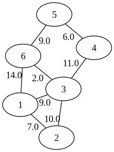

# Dijkstra Algorithm Example



This example shows an implementation for Shortest Paths Dijkstra Algorithm.

To run the program:

```sh
zig build run
```

The output is:

```text
Distances from node 1:
Node  Distance  Adjacent
------------------------
   2         7         1
   3         9         1
   4        20         3
   5        20         6
   6        11         3
```
